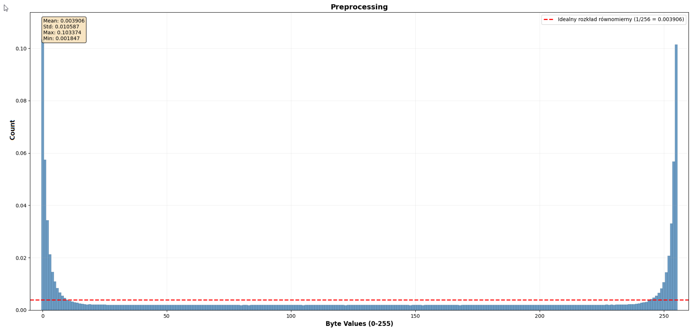
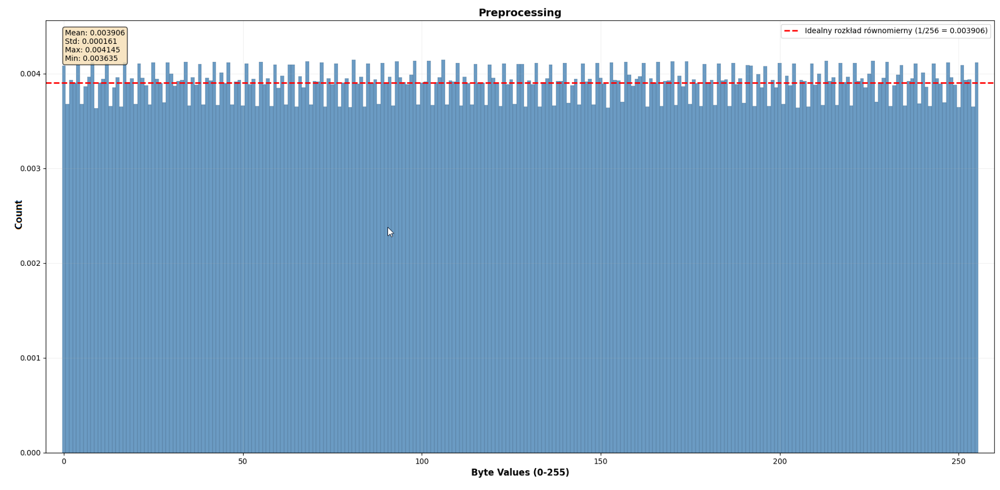
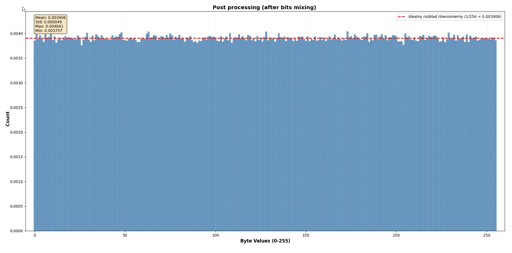
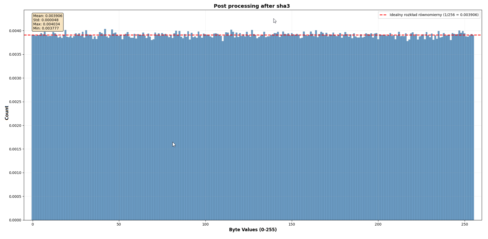
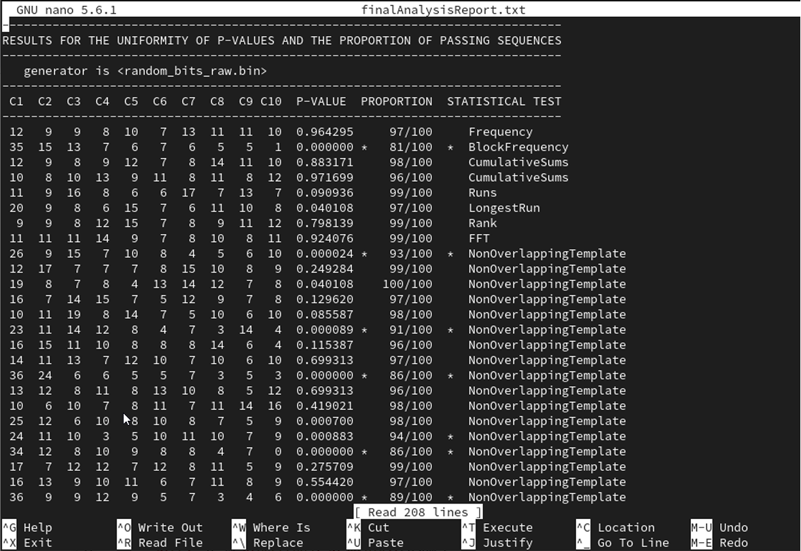
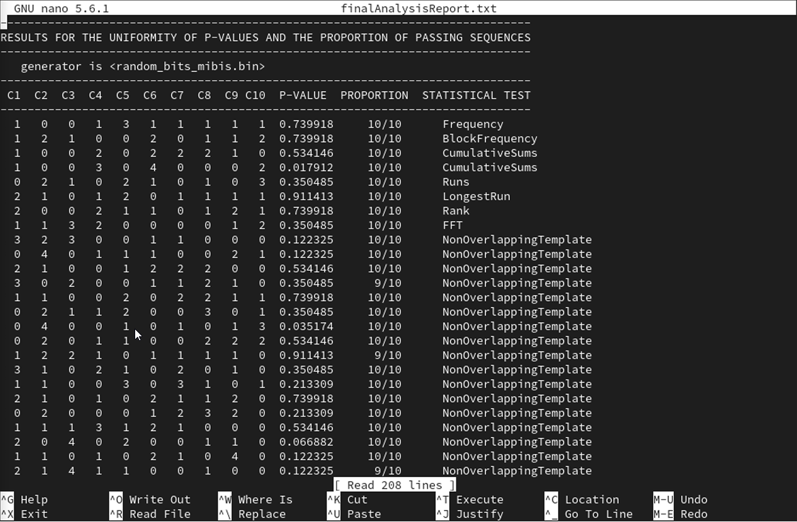

# True Random Number Generator Using Environmental Audio and MiBiS&XOR

This project implements a True Random Number Generator (TRNG) using a computer microphone and sound card. It is based on the paper:

> **S. Nikolic, M. Veinovic**, _"Advancement of True Random Number Generators Based on Sound Cards Through Utilization of a New Post-processing Method"_, Wireless Personal Communications, vol. 91, pp. 603–622, 2016.

The project uses environmental noise captured through a microphone, processes the audio samples, and extracts high-quality random bits using the **MiBiS&XOR** method.

---

## Features

- Captures real-world noise via microphone using `PyAudio`
- Extracts least and mid-significant bits from audio samples
- Applies **MiBiS&XOR** post-processing:
  - Bit mixing (MiBiS)
  - XOR-ing of adjacent bits
- Supports **NIST 800-22** randomness testing


---

## How It Works

### Overview
The **MiBiS&XOR** algorithm is a two-stage post-processing technique designed to enhance the statistical quality of extracted bits from random number generators. This algorithm significantly improves entropy and reduces statistical bias to meet stringent randomness requirements.

### Algorithm Description

The MiBiS&XOR algorithm consists of two sequential stages:

#### Stage 1: Bit Mixing (MiBiS)

The bit mixing stage reorganizes bits from the raw input stream using a deterministic mixing pattern to minimize short-range correlations.

**Key Features:**
- Separates originally adjacent and potentially correlated bits
- Redistributes bits across a buffer using a recursive pattern
- Maintains first and last bit positions unchanged
- All other bits are inserted between them following the mixing algorithm

**Buffer Configuration:**
- Buffer size: `buffer_size = 2^(steps - 1) + 1`
- Steps calculation: `steps = log2(num_bits - 1) + 1`

#### Stage 2: XOR Operation

After the mixing phase, adjacent bit pairs undergo XOR operations to further enhance randomness.

**Benefits:**
- Increases entropy by blending decorrelated bits
- Reduces statistical bias in the output
- Creates new outputs with improved randomness properties


### Steps
1. **Audio Capture**  
   Using `PyAudio`, environmental noise is recorded at a sample rate of **44.1 kHz** with **16-bit resolution**. The microphone acts as the physical entropy source.

2. **Bit Extraction**  
   From each audio sample, a configurable number of bits is extracted. The default `optimized` mode uses **4 bits per sample** — typically bits **0, 1, 4, and 5** — balancing speed and randomness quality.

3. **MiBiS&XOR Post-Processing**
   - **MiBiS (Mixing Bits in Steps)**: This step spatially separates input bits that may be statistically correlated by inserting them into a new buffer following a binary subdivision pattern. Bits that were close in the original stream become distant in the output.
   - **Dual-Mixer Architecture**: To enable continuous processing without gaps, two independent mixing buffers operate in an alternating fashion. While one mixer processes and outputs a batch, the second one starts loading the next set of input bits.
   - **XOR Stage**: Once mixed, adjacent bits in the buffer are XORed to further improve statistical properties by removing residual bias and reducing autocorrelation.

4. **SHA3-256**
   - Applies a cryptographic hash on blocks of 256 bits for comparison.

---

## Screenshots

### Histogram – Raw Audio Samples


### Histogram – Extracted Bits (LSBs)



### Histogram – After MiBiS&XOR



### Histogram – After SHA3-256 to compare with MIBiS&XOR 



---

## NIST 800-22 Statistical Test Results

### Nist test Raw Audio

**Entropy:** 5.578517  
**Normalized Entropy:** 0.6973


### Nist test Extracted Bits

**Entropy:** 7.998769  
**Normalized Entropy:** 0.999846

### Nist test After MiBiS&XOR

**Entropy:** 7.999987  
**Normalized Entropy:** 0.999998

See full results in [`test_results/mibis.txt`](test_results/mibis.txt) and [`test_results/sha3.txt`](test_results/sha3.txt).

---

## Performance Metrics

The algorithm achieves exceptional statistical quality:

- **Entropy**: 7.999987
- **Normalized Entropy**: 0.999998
- **Compliance**: Satisfies NIST 800-22 statistical test suite requirements

---

## Usage

To generate random bits using the TRNG, run:
```bash
python main.py -o output/random_bits -n 1000000 -e optimized --bits-per-sample 4
```

---

### CLI Arguments

| Argument | Description |
|----------|-------------|
| `-o, --output` | Base name for output files (default: random_bits) |
| `-n, --bits` | Total number of random bits to generate (default: 13,000,000) |
| `-b, --batch` | Size of a single processing batch in bits (default: 1,048,576) |
| `-e, --extraction` | Bit extraction method: lsb, optimized, or threshold |
| `--bits-per-sample` | Number of bits to extract from each sample (default: 4) |
| `-s, --single-mixer` | Use a single MiBiS mixer (by default, dual mixers are used) |


